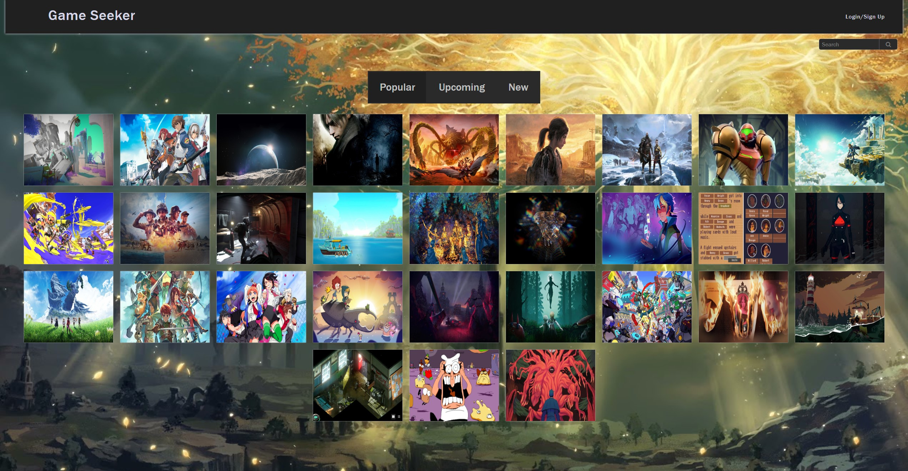
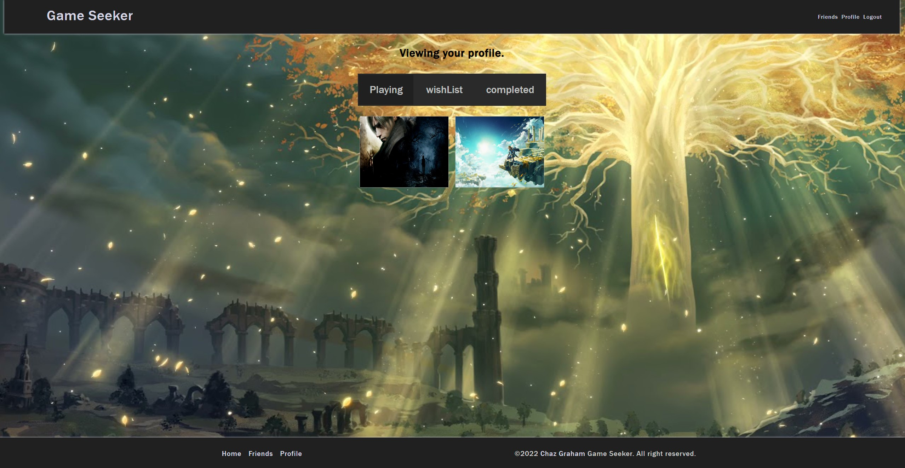

# Game Seeker

  
  

## Descripton
An application that uses apollo servers working with mongoDB to provide a back-end database and React for the front-end. The application uses GraphQL mutations and queries to add and delete information to the users model. The application uses API calls to get access to RAWGs gaming library.
Link to deployed application can be found here https://game-seeker.herokuapp.com/

## Table of Contents
  * [Installation Instructions](#installation-instructions)
  * [Application Usage](#application-usage)
  * [Contributors](#contributors)
  * [Licenses](#licenses)
  * [Tests](#tests)
  * [Contact Me](#contact-me)

## Installation Instructions
Before running this application you must install -Please run `npm i` in the files root, cleint, and server directories.

## Application Usage
The application allows users to track games they've played, are playing, and have completed. It also allows the user to make friends and view the same list on their profiles.

## Contributors
By Chaz Graham

## Licenses
This application is licensed under: ISC

## Tests
To test application open the console and run the following comand: No testing at this time.

## Contact Me
If you have additional questions you can contact me at https://github.com/chazgraham or by Emailing me at chazhg80.cg@gmail.com